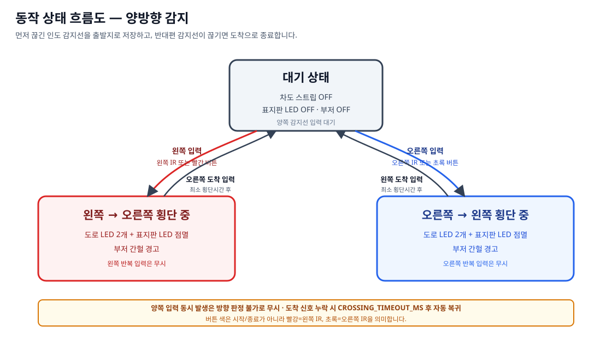
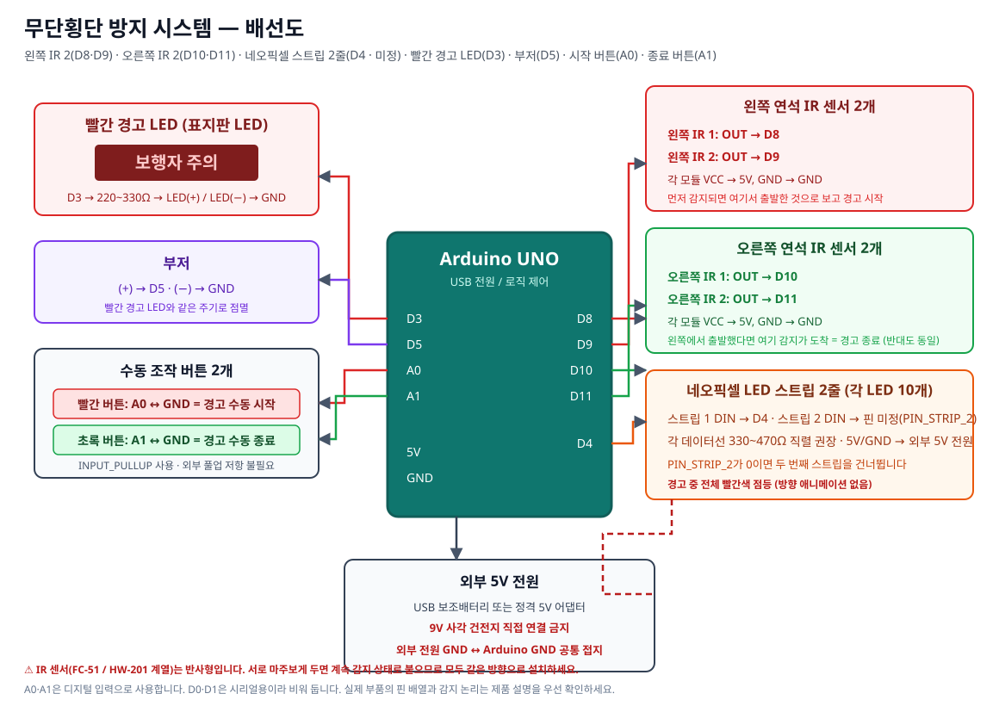

# 무단횡단 방지 시스템

천안시 청소년 도시재생 챌린지(U-CAST) — AI 기반 천안시 지역현안 해결 리빙랩  
**5팀 「건영아 잘하자」 / 하드웨어형 산출물**

도로를 사이에 둔 **양쪽 연석에 IR 센서를 2개씩** 놓고, 보행자가 차도로 들어서면
경고를 시작해 반대편에 도착할 때까지 유지하는 아두이노 장치입니다.
경고 중에는 네오픽셀 스트립 2줄이 전체 빨간색으로 켜지고,
운전자 경고용 빨간 LED와 부저가 함께 점멸합니다.

> **양방향입니다.** 보행자가 어느 쪽에서 출발하든 똑같이 동작합니다.
> 먼저 감지된 쪽을 출발 쪽으로 기억했다가, 그 **반대편**이 감지될 때 경고를 끝냅니다.

---

## 1. 팀 정보

| 항목 | 내용 |
|---|---|
| 팀 번호 | 5 |
| 팀명 | 건영아 잘하자 |
| 프로젝트 이름 | 무단횡단 방지 시스템 |
| 산출물 유형 | 하드웨어형(Arduino Uno) |

### 팀원 및 역할

| 이름 | 직책 | 담당 역할 |
|---|---|---|
| 안OO | 팀장 / 디자이너 | 팀 리딩, 발표, 디자인 |
| 황OO | 기획 | 기획, 아이디어 제공, 디버깅 |
| 안OO | 엔지니어 | 아두이노 배선 및 정리 |
| 주OO | 엔지니어 | 아두이노 코드 알고리즘 작성 및 프로그램 제작|

### 멘토

| 이름 | 직책 | 담당 역할 |
|---|---|---|
| 이건영 | 조교 | 5조 멘토링 |

---

## 2. 문제 정의

| 항목 | 내용 |
|---|---|
| 해결하려는 문제 | 천안중앙시장 주변에서 고령 보행자가 갑자기 차도로 진입해 발생하는 무단횡단 위험을 줄인다 |
| 문제를 겪는 사람 | 천안중앙시장을 이용하는 65세 이상 고령 보행자와 주변 도로 운전자 |
| 발생 장소 | 천안 중앙시장 및 중앙동 일대(충남 천안시 동남구 사직동 290 부근) |
| 발생 상황 | 주정차 차량과 시장 출입구 사이의 사각지대에서 보행자가 갑자기 도로로 진입 |
| 운전자 측 위험 | 보행자를 늦게 발견해 급제동하거나 후속 차량과 추돌할 위험 |
| 보행자 측 위험 | 운전자에게 자신의 진입이 보이지 않는 상태에서 도로를 건넘 |
| 적용 가능 장소 | 중앙시장 주변 도로, 먹자골목 등 보행자와 차량이 혼재하는 구간 |

관련 아이디어는 이슈 #6의 “횡단보도가 아닌 구간을 건너는 보행자를 감지해 바닥 LED를 빨간색으로 점등한다”는 방향을 반영합니다.

---

## 3. 최종 MVP 기능

| 구분 | 내용 |
|---|---|
| 진입 감지 | 양쪽 연석에 IR 2개씩 설치. 먼저 감지된 쪽이 출발 쪽 |
| 도착 감지 | 출발 쪽의 **반대편** 센서가 감지되면 횡단 완료 |
| 양방향 | 왼→오, 오→왼 모두 같은 방식으로 동작 |
| 경고 시작 | 어느 쪽이든 차도 진입이 감지되면 경고 시작 |
| 경고 종료 | 반대편 도착이 감지되면 경고 종료 |
| 운전자 경고 | 네오픽셀 스트립 2줄 전체 빨간색 점등 + 운전자 경고용 빨간 LED 점멸 |
| 소리 경고 | 부저가 빨간 경고 LED와 같은 주기로 작동 |
| 수동 시연 | 빨간 버튼 = 경고 수동 시작, 초록 버튼 = 경고 수동 종료 |

### 초기 검토 후 제외한 기능

워크북 앞부분(2~4장)에 남아 있는 다음 기능은 최종 MVP에 포함하지 않습니다.

- 펜스와 압력센서(FSR)
- 초음파센서
- 횡단보도 방향 계산과 안전한 길 방향 유도
- 흐르는 방향성 LED 애니메이션

경고 중 스트립은 방향 애니메이션 없이 **전체가 빨간색으로 켜집니다.**

---

## 4. 센서 배치와 알고리즘

### 센서 구성

IR 센서는 개별 디지털 출력 모듈 4개를 사용하며, 각각 별도의 핀을 씁니다.
도로를 사이에 두고 **양쪽 연석에 2개씩** 나눠 놓습니다.

```text
      왼쪽 연석                  차도                   오른쪽 연석
  [IR D8] [IR D9]           [LED 스트립]           [IR D10] [IR D11]
       └──────── 어느 쪽이든 먼저 감지되면 경고 시작 ────────┘
                  반대편이 감지되면 경고 종료
```

왼쪽/오른쪽은 그냥 **서로 반대편 연석**이라는 뜻입니다. 어느 쪽을 왼쪽이라 부르든
상관없습니다.

### 상태 전이 (양방향)

상태는 **대기**와 **경고 중** 두 가지뿐이고, 여기에 "어느 쪽에서 출발했는지"를
기억하는 값(`startedFrom`) 하나가 붙습니다.

```text
[대기]
  ├─ 왼쪽 IR 감지   → [경고 중] (startedFrom = 왼쪽,  도착 판정 = 오른쪽)
  ├─ 오른쪽 IR 감지 → [경고 중] (startedFrom = 오른쪽, 도착 판정 = 왼쪽)
  └─ 빨간 시작 버튼 → [경고 중] (startedFrom = 없음,  도착 판정 = 양쪽 다)

[경고 중]
  ├─ 기억해 둔 반대편 감지 → [대기]
  ├─ 초록 종료 버튼        → [대기]
  └─ 출발한 쪽 재감지      → 경고 유지 (무시)
```

논리식으로는 다음과 같습니다.

```text
leftEvent  = leftSensor1Detected  || leftSensor2Detected
rightEvent = rightSensor1Detected || rightSensor2Detected

// 대기 상태
startedFrom = 먼저 감지된 쪽

// 경고 상태 — 출발 쪽의 반대편만 도착으로 인정
arrived = (startedFrom == 왼쪽)   ? rightEvent
        : (startedFrom == 오른쪽) ? leftEvent
        :                           (leftEvent || rightEvent)
```

### 동시 입력 정책

| 상태 | 입력 | 처리 |
|---|---|---|
| 대기 | 같은 연석의 IR 2개 동시 감지 | 경고를 한 번만 시작 |
| 대기 | 양쪽이 같은 순간에 감지 | **모호한 입력으로 보고 시작하지 않음.** 시리얼에 `입력 무시: 양쪽이 동시에 감지됨`을 남깁니다 |
| 대기 | 한쪽 감지 + 반대쪽이 계속 감지 중 | 같은 이유로 시작하지 않음 |
| 대기 | 초록 버튼 | 무시 |
| 경고 중 | 반대편 IR 2개 동시 감지 | 종료 |
| 경고 중 | **출발한 쪽** 재감지 | 경고 유지(상태 변경 없음) |
| 경고 중 | 빨간 버튼 재입력 | 경고 유지 |

빨간 버튼은 방향·센서와 무관한 **강제 시작**이므로 모호 입력 판정의 영향을 받지
않습니다. 다만 출발 쪽을 모르므로 **어느 쪽 센서로도** 종료됩니다.
초록 버튼은 같은 이유로 **강제 종료**로 동작합니다.

모호 입력 보호는 `IR_AMBIGUITY_GUARD`로 끌 수 있지만, 이 로그가 계속 나온다면
**센서가 서로를 보고 있는 것**이므로 배치부터 고치는 것이 맞습니다.



---

## 5. 부품 목록

| 부품 | 수량 | 역할 |
|---|:--:|---|
| Arduino Uno | 1 | 전체 상태 판정과 출력 제어 |
| 브레드보드 | 1 | 회로 구성 |
| 점퍼선 | 필요 수량 | 부품 연결 |
| 적외선 센서(IR) | 4 | 진입 감지 2개 + 통과 감지 2개 |
| 네오픽셀 LED 스트립 | 2 | 경고 중 전체 빨간색 점등 (각 LED 10개) |
| 빨간색 LED 또는 표지판 LED | 1 | 운전자에게 시각적으로 경고 |
| 부저 | 1 | 운전자에게 청각적으로 경고 |
| 빨간 버튼 | 1 | 경고 수동 시작 |
| 초록 버튼 | 1 | 경고 수동 종료 |
| 220~330Ω 저항 | 1 | 빨간 LED 보호(저항 내장 모듈이면 불필요) |
| 330~470Ω 저항 | 2 | 네오픽셀 데이터선 보호 권장 |
| 5V 외부 전원 | 1 | LED 스트립 전원 공급 |

> 표지판 안에 일반 LED를 여러 개 넣을 경우 아두이노 D3에 직접 병렬 연결하지 않습니다.
> 각 LED에 저항을 사용하고, 전류가 커지면 트랜지스터 또는 MOSFET 구동 회로를 추가해야 합니다.



---

## 6. 핀 연결표

| 부품 | 핀 | 코드 상수 | 역할 |
|---|:--:|---|---|
| 빨간 경고 LED | D3 | `PIN_WARN_LED` | 운전자 경고용 점멸 |
| LED 스트립 1 DIN | D4 | `PIN_STRIP_1` | 경고 조명 1 |
| LED 스트립 2 DIN | **미정** | `PIN_STRIP_2` | 경고 조명 2 (핀 번호를 직접 지정) |
| 부저 | D5 | `PIN_BUZZER` | 경고음 |
| 왼쪽 연석 IR 센서 1 | D8 | `PIN_IR_LEFT_1` | 차도 진입·도착 감지 |
| 왼쪽 연석 IR 센서 2 | D9 | `PIN_IR_LEFT_2` | 차도 진입·도착 감지 |
| 오른쪽 연석 IR 센서 1 | D10 | `PIN_IR_RIGHT_1` | 차도 진입·도착 감지 |
| 오른쪽 연석 IR 센서 2 | D11 | `PIN_IR_RIGHT_2` | 차도 진입·도착 감지 |
| 빨간 버튼 | A0 | `PIN_BTN_START` | 경고 수동 시작 |
| 초록 버튼 | A1 | `PIN_BTN_STOP` | 경고 수동 종료 |

A0·A1은 디지털 입력으로 사용합니다(우노에서 각각 디지털 14·15번과 같은 핀).
D0·D1은 시리얼 통신용이라 아무것도 연결하지 않습니다.

> **두 번째 스트립의 핀은 아직 정하지 않았습니다.** `main.ino`의 `PIN_STRIP_2`가
> `0`으로 되어 있고, 이 값이 `0`인 동안에는 두 번째 스트립을 **건너뜁니다.**
> 스트립 1줄만 꽂아도 그대로 동작합니다. 쓸 핀을 정해 그 자리에 번호를 적으면
> 2줄로 동작합니다. 지금 비어 있는 핀: **D2, D6, D7, D12, D13, A2~A5**

### IR 센서 배선

제품마다 선 색과 핀 순서가 다르므로 **제품 설명의 핀 표기를 우선 확인**합니다.

- 왼쪽 연석 모듈: `VCC` → 5V, `GND` → GND, `OUT` → **D8**, **D9**
- 오른쪽 연석 모듈: `VCC` → 5V, `GND` → GND, `OUT` → **D10**, **D11**
- 감지 시 출력이 LOW가 아니면 코드의 `IR_ACTIVE_LOW`를 `false`로 변경합니다.
- 이 모듈은 보드에 풀업이 있어 `IR_USE_INTERNAL_PULLUP = false`가 기본입니다.
  값이 떠다니면 `true`로 되돌립니다.

> ⚠ **IR 센서끼리 마주보게 두지 마세요.**
> 사용하는 FC-51 / HW-201 계열 모듈은 송신 LED(투명)와 수신 LED(검정)가 한 보드에
> 같이 붙은 **반사형 장애물 감지** 모듈입니다. 앞으로 쏜 적외선이 물체에 맞고
> 돌아오는 것을 감지하며, 빔이 끊기는 것을 보는 송수신 분리형이 아닙니다.
> 마주보게 두면 서로의 적외선이 상대 수신부에 직접 들어가 **손이 없어도 계속 감지
> 상태로 붙어버립니다.** 모든 센서를 보행자가 지나갈 쪽을 향해 같은 방향으로 두고,
> 모듈 위의 파란 나사로 감지 거리(약 2~30cm)를 맞춥니다.

### 네오픽셀 배선

- 스트립 1 `DIN` → D4
- 스트립 2 `DIN` → `PIN_STRIP_2`에 적은 핀 (아직 미정)
- 각 데이터선에 330~470Ω 직렬 저항 권장
- 두 스트립 `5V` → 외부 5V 전원
- 두 스트립 `GND` → 외부 전원 GND
- 외부 전원 GND와 Arduino GND를 반드시 공통 연결

### 빨간 LED·부저·버튼

- 빨간 LED: D3 → 220~330Ω → LED `+`, LED `−` → GND
- 부저: `+` → D5, `−` → GND
- 빨간 버튼: 한쪽 → A0, 반대쪽 → GND
- 초록 버튼: 한쪽 → A1, 반대쪽 → GND
- 버튼은 `INPUT_PULLUP`을 사용하므로 외부 풀업 저항이 필요하지 않습니다.

### 전원

네오픽셀은 USB 보조배터리나 정격 5V 어댑터를 사용합니다. 일반 9V 사각 건전지를
네오픽셀에 직접 연결하지 않습니다.

---

## 7. 코드 구조

`main.ino`는 `delay()` 없이 `millis()` 기반으로 동작합니다.

### 상태

| 상태 | 의미 |
|---|---|
| `STATE_IDLE` | 대기. 모든 출력 꺼짐. 양쪽 IR 또는 빨간 버튼을 기다림 |
| `STATE_WARNING` | 경고 중. 스트립·빨간 LED·부저 작동. **출발 쪽의 반대편** IR 또는 초록 버튼을 기다림 |

`startedFrom`(`SIDE_LEFT` / `SIDE_RIGHT` / `SIDE_NONE`)이 이번 횡단의 출발 쪽을
기억합니다. 종료할 때 `SIDE_NONE`으로 지워 다음 횡단에 영향을 주지 않습니다.

### 주요 함수

| 함수 | 역할 |
|---|---|
| `detectedEdge()` | IR 신호가 일정 시간 유지된 뒤 감지로 바뀌는 순간만 1회 반환 |
| `buttonPressedEdge()` | 버튼 채터링을 제거하고 누르는 순간만 1회 반환 |
| `enterWarning()` | 스트립 전체 점등, 빨간 LED·부저 경고 시작 |
| `enterIdle()` | 모든 출력을 끄고 대기 상태 복귀 |
| `applyStrips()` | 연결된 스트립을 전체 빨간색으로 켜거나 완전히 끔 |
| `setStripColor()` | 스트립 하나의 모든 픽셀 색을 정하고 한 번에 전송 |
| `applyBlinkOutputs()` | 빨간 경고 LED와 부저를 같은 상태로 함께 제어 |
| `updateBlinkOutputs()` | `WARNING_BLINK_MS` 간격으로 점멸 상태 전환 |

### 조정값

| 상수 | 기본값 | 의미 |
|---|:--:|---|
| `PIN_STRIP_2` | 0 | **두 번째 스트립 DIN 핀. 0이면 두 번째 스트립을 건너뜀** |
| `STRIP_1_PIXELS`, `STRIP_2_PIXELS` | 10 | 각 스트립에 박힌 낱개 LED 개수 |
| `IR_AMBIGUITY_GUARD` | `true` | 양쪽이 동시에 감지되면 시작하지 않음 |
| `STRIP_BRIGHTNESS` | 120 | 스트립 밝기 |
| `WARNING_BLINK_MS` | 300 | 빨간 경고 LED·부저 점멸 간격 |
| `BUZZER_FREQUENCY_HZ` | 1000 | 부저 음 높이 |
| `IR_ACTIVE_LOW` | `true` | 감지 시 LOW를 출력하는지 여부(제품별로 다름) |
| `IR_USE_INTERNAL_PULLUP` | `true` | IR 출력에 내부 풀업 사용 여부 |
| `IR_CONFIRM_MS` | 80 | 신호 확정 시간 |
| `BUTTON_DEBOUNCE_MS` | 40 | 버튼 채터링 제거 시간 |
| `WARNING_TIMEOUT_MS` | 0 | **워크북 원본 기능이 아닌 선택 설정.** 0이면 자동 종료 없음 |

`WARNING_TIMEOUT_MS`는 안전 복귀용 선택 기능입니다. 워크북의 기획에는 자동 종료가
없으므로 기본값은 0(비활성)이며, 시연 중 종료 입력이 누락되는 상황이 걱정될 때만
0보다 큰 값을 넣어 사용합니다.

---

## 8. 테스트

실물 보드 없이 상태 머신을 검증하는 회귀 테스트가 `tests/`에 있습니다.

```bash
bash tests/run-tests.sh
```

- `tests/test_state_machine.cpp` — 시작·종료·무효 입력·입력 안정성·출력·핀 배정 검증 24개
- `tests/stubs/` — `Arduino.h`, `Adafruit_NeoPixel.h` 테스트용 스텁

이 테스트는 상태 전이와 출력 논리만 확인합니다. IR 모듈의 실제 출력 논리와
부저 음량 같은 값은 실물에서 따로 확인해야 합니다.

### IR 2개 축소판 스케치 (`test/test.ino`)

최종 발표 회로는 IR 센서를 4개 씁니다. 하지만 **지금 가지고 있는 IR 센서는 2개**라서,
가진 부품만으로 먼저 조립하고 알고리즘을 확인할 수 있도록 축소판을 따로 둡니다.

| 항목 | 최종(`main.ino`) | 축소판(`test/test.ino`) |
|---|---|---|
| 진입 감지 | IR 2개, D8 · **D9** | IR 1개, **D8** |
| 통과 감지 | IR 2개, D10 · **D11** | IR 1개, **D10** |
| LED 스트립 | 1줄, D4 | 1줄, D4 |
| 빨간 경고 LED | D3 | D3 |
| 부저 | D5 | D5 |
| 빨간 버튼 | A0 | A0 (지금 미연결) |
| 초록 버튼 | A1 | A1 (지금 미연결) |

축소판이 쓰는 핀은 최종 구성의 **부분집합**입니다. 그래서 **센서 2개를 더 구하면
비어 있는 D9·D11에 꽂고 `main.ino`를 올리기만 하면** 기존 선은 하나도 옮기지 않고
최종 구성이 됩니다.

축소판에만 있는 설정도 몇 개 있습니다.

| 상수 | 기본값 | 이유 |
|---|:--:|---|
| `USE_BUTTONS` | `false` | 버튼을 아직 안 달았음. `true`로 바꾸면 A0·A1을 읽음 |
| `WARNING_TIMEOUT_MS` | `10000` | 버튼이 없어 손으로 끌 수 없으므로 10초 뒤 자동 복귀 |
| `STARTUP_SELFTEST` | `true` | 부팅 시 스트립·LED·부저를 한 번 켜서 출력 배선 확인 |
| `IR_LOG_INTERVAL_MS` | `400` | 두 IR의 핀값과 판정을 시리얼에 계속 출력(감도 조절용) |
| `IR_AMBIGUITY_GUARD` | `true` | 두 센서가 동시에 감지 중이면 시작하지 않음 |

상태 전이 규칙과 동시 입력 정책도 두 파일이 완전히 같습니다. **알고리즘을 바꿀 때는
두 파일을 함께 고칩니다.**

> `test/test.ino`는 반드시 `test/` 폴더 안에 두어야 합니다. Arduino IDE는 한 스케치
> 폴더 안의 모든 `.ino`를 합쳐 컴파일하므로, `main.ino` 옆에 두면 `setup()`과
> `loop()`가 중복 정의되어 빌드가 실패합니다.

저장소의 회로 자료(아래 두 장)는 Tinkercad에서 IR 센서를 가변저항 4개로 **대체해**
그린 것입니다. Tinkercad에는 디지털 IR 모듈이 없고 `Adafruit NeoPixel`도 그대로
지원되지 않기 때문이며, 실제 배선은 위 표와 6장 핀 연결표를 따릅니다.

- 회로 구성: [브레드보드 구성 예시(버튼 포함)](docs/images/5조%20회로%20구성%20예시_버튼%20추가.png)
- 스키매틱: [아두이노 스키매틱](docs/images/5조%20아두이노%20스키매틱.pdf)

---

## 9. 제작 및 시연 순서

상세 절차는 [4차시 제작 가이드](docs/assembly-guide.md)를 따릅니다.

1. 버튼 두 개만 연결해 수동 시작·종료를 확인합니다.
2. 빨간 경고 LED와 부저를 연결합니다.
3. 네오픽셀 스트립(D4)을 연결합니다.
4. 지금 가진 IR 2개를 D8(진입)·D10(통과)에 붙이고 `test/test.ino`로 확인합니다.
5. IR 2개를 더 구하면 D9·D11에 꽂아 4개를 채우고 `main.ino`를 올립니다.
6. 한쪽 진입 → 경고 시작, 반대편 도착 → 경고 종료를 **양방향 모두** 확인합니다.

### 발표 때 보여줄 핵심 장면

- 왼쪽에서 진입 → 스트립 빨간색 점등 + 빨간 LED·부저 점멸 → 오른쪽 도착 → 종료
- **반대 방향으로도** 같은 시연 (오른쪽에서 진입 → 왼쪽 도착 → 종료)
- 출발한 쪽 앞에서 다시 손을 흔들어도 경고가 꺼지지 않음(같은 사람이므로)
- 센서가 불안정할 때 빨간·초록 버튼으로 시작·종료를 수동 시연

---

## 10. 알려진 제약

- 양쪽이 동시에 감지되면 모호한 입력으로 보고 경고를 시작하지 않습니다.
- 여러 사람이 동시에 오갈 때 개별 보행자를 구분하지 않습니다.
- 직사광선, 설치 각도, 제품별 출력 논리 차이로 오작동할 수 있습니다.
- 반사형 IR 모듈이라 검은색·광택 표면은 적외선을 잘 되돌리지 않아 감지가 약합니다.
- `main.ino`는 자동 종료가 기본 비활성이므로, 반대편 도착이 감지되지 않으면 경고가
  계속 유지됩니다. 이때는 초록 버튼으로 종료합니다.
  (`test/test.ino`는 버튼이 없어 10초 자동 복귀가 기본으로 켜져 있습니다.)
- Tinkercad는 `Adafruit NeoPixel` 라이브러리를 그대로 지원하지 않아 스트립은 실물에서 확인해야 합니다.
- 이 장치는 무단횡단을 물리적으로 막지 않습니다. 이미 도로에 진입한 보행자를 감지해
  운전자와 보행자에게 알리는 2차 사고 예방 장치입니다(이슈 #6).

문제 발생 시 [문제 해결 가이드](docs/troubleshooting.md)를 확인합니다.

---

## 11. 파일 구성

```text
2026_U-CAST/
├── main.ino
├── README.md
├── AGENTS.md
├── CLAUDE.md
├── CHATGPT.md
├── test/
│   └── test.ino
├── docs/
│   ├── workbook-3rd-session.md
│   ├── assembly-guide.md
│   ├── troubleshooting.md
│   └── images/
│       ├── breadboard-wiring.svg
│       ├── state-flow.svg
│       ├── 5조 회로 구성 예시.png
│       ├── 5조 회로 구성 예시_버튼 추가.png
│       └── 5조 아두이노 스키매틱.pdf
└── tests/
    ├── run-tests.sh
    ├── test_state_machine.cpp
    └── stubs/
        ├── Arduino.h
        └── Adafruit_NeoPixel.h
```
